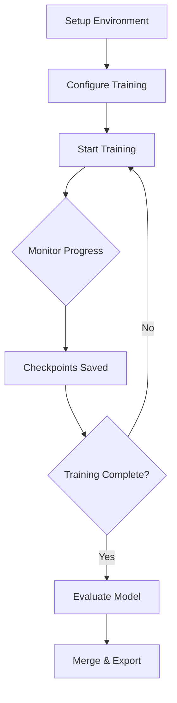

# 🎮 PPO+LoRA Training for Game Environment - Complete Setup

**Complete implementation for training Qwen3-4B with PPO+LoRA on OpenSpiel games**

---

## 📦 What's Included

### Core Training Files
- **`train_ppo_lora.py`** - Main training script with PPO+LoRA implementation
- **`env_wrapper.py`** - RL environment wrapper for game integration
- **`curriculum.py`** - Curriculum learning + failure-based sampling
- **`utils.py`** - Helper functions (checkpointing, logging, etc.)

### Configuration Files
- **`config/train_config.json`** - Training hyperparameters
- **`config/curriculum_config.json`** - Curriculum stages
- **`config/env_config.json`** - Environment settings

### Scripts
- **`scripts/setup.sh`** - One-click setup script
- **`scripts/configure.py`** - Interactive configuration wizard
- **`scripts/evaluate.py`** - Model evaluation script
- **`scripts/merge.py`** - Merge LoRA adapters with base model

### Documentation
- **`README.md`** - Full technical documentation
- **`GUIDE.md`** - Step-by-step training guide
- **`QUICKSTART.md`** - This file

---

## ⚡ Quick Start (3 Commands)

```bash
# 1. Setup environment
cd /root/workstation/sn120/stage_4/game_rl_training
bash scripts/setup.sh

# 3. Start training
python train_ppo_lora.py
```

That's it! This setup uses **local OpenSpiel execution** (no vLLM, no env server). A good first run is **~5k steps**.

---

## 🎯 Key Features

### 1. PPO (Proximal Policy Optimization)
- Industry-standard RL algorithm
- Stable training with clipped objectives
- KL divergence constraint prevents policy collapse

### 2. LoRA (Low-Rank Adaptation)
- Trains only 0.5% of parameters (~15M out of 3B)
- 500MB checkpoints instead of 6GB
- Can train 3B model on single GPU (16GB VRAM)

### 3. Curriculum Learning
- **Stage 1**: Easy games, random opponent (60% threshold)
- **Stage 2**: Medium games, random opponent (50% threshold)
- **Stage 3**: Hard games, MCTS opponent (40% threshold)
- Automatic progression based on performance

### 4. Failure-Based Sampling
- Buffer of 1000 most difficult tasks
- 30% of samples from failure buffer
- Priority sampling: worse tasks = higher probability
- Ensures mastery of difficult scenarios

### 5. Live Environment Integration
- Task-ID aware (deterministic game configuration)
- Rules enforced by environment, not model
- 20 different OpenSpiel games
- Supports 2-4 player games

---

## 📊 Training Configuration

### Default Setup (Recommended)

```json
{
  "Model": "Qwen2.5-3B-Instruct",
  "Quantization": "4-bit (NF4)",
  "LoRA Rank": 16,
  "Batch Size": 8,
  "Learning Rate": "1e-5",
  "Training Steps": 10000,
  "GPU Memory": "~10GB",
  "Training Time": "~80-100 hours",
  "Checkpoint Size": "~500MB"
}
```

### What You Get

After training:
- **Easy stage**: 60-70% win rate vs random opponent
- **Medium stage**: 45-55% win rate vs random opponent  
- **Hard stage**: 30-40% win rate vs MCTS opponent

---

## 🚀 Training Workflow



### Training Loop

1. **Sample Task** - Curriculum sampler selects task (70% curriculum, 30% failures)
2. **Generate Rollout** - Model plays game, collects experience
3. **Compute Advantages** - Calculate how good actions were
4. **Update Policy** - PPO update with clipped objective
5. **Update Value Function** - Predict future rewards
6. **Check Curriculum** - Advance stage if success rate meets threshold
7. **Save Checkpoint** - Every 500 steps
8. **Repeat** - Until num_train_steps completed

---

## 📈 Expected Performance

### Training Progress

| Steps | Hours | Stage | Success Rate | Description |
|-------|-------|-------|--------------|-------------|
| 0 | 0 | Easy | 20-30% | Random play |
| 1000 | 8-10 | Easy | 40-50% | Learning basics |
| 3000 | 24-30 | Easy | 60-65% | Competent play |
| 5000 | 40-50 | Medium | 35-45% | New challenges |
| 8000 | 64-80 | Medium | 50-55% | Strategic play |
| 10000 | 80-100 | Hard | 30-40% | Advanced tactics |

### Memory Requirements

| Config | VRAM | Batch Size | Training Time | Quality |
|--------|------|------------|---------------|---------|
| Minimal | 10GB | 2 | ~120h | Good |
| Default | 16GB | 8 | ~80h | Better |
| Optimal | 24GB+ | 16 | ~60h | Best |

---

## 🎓 Architecture Overview

### Model Architecture
```
Qwen2.5-3B-Instruct (Base Model)
├── Transformer Layers (frozen)
│   ├── Attention Layers
│   │   ├── Q, K, V projections + LoRA adapters (trainable)
│   │   └── Output projection + LoRA adapter (trainable)
│   └── MLP Layers
│       └── Gate/Up/Down + LoRA adapters (trainable)
└── Value Head (trainable)
    └── Linear layer for state value estimation
```

### Training Components
```
PPO Trainer
├── Policy Model (with LoRA)
├── Reference Model (frozen, for KL divergence)
├── Value Function (estimates future rewards)
├── Environment Wrapper (game interface)
└── Curriculum Sampler (task selection)
```

---

## 🔧 Customization

### Adjust Difficulty Progression

Edit `config/curriculum_config.json`:
```json
{
  "curriculum_stages": [
    {
      "name": "beginner",
      "task_range": [0, 500000000],
      "opponent": "random",
      "min_success_rate": 0.7  // Easier threshold
    }
  ]
}
```

### Change Reward Function

Edit `env_wrapper.py`, method `_compute_reward()`:
```python
def _compute_reward(self, score, success, extra):
    reward = score  # Base reward
    
    # Add custom shaping
    if success:
        reward += 1.0  # Success bonus
    
    if extra.get("game_length") < 10:
        reward += 0.2  # Quick win bonus
    
    return reward
```

### Modify Sampling Strategy

Edit `curriculum.py`:
```python
# Increase failure replay
failure_replay_prob = 0.5  # Default: 0.3

# Adjust progression threshold
progression_threshold = 0.8  # Default: 0.7
```

---

## 🐛 Troubleshooting

### Problem: CUDA Out of Memory

**Solution:**
```json
// config/train_config.json
{
  "model": {"use_4bit": true},
  "ppo": {
    "batch_size": 2,
    "gradient_accumulation_steps": 16
  }
}
```

### Problem: Training Unstable

**Solution:**
- Reduce learning rate: `1e-5` → `5e-6`
- Increase PPO epochs: `4` → `6`
- Lower KL coefficient: `0.2` → `0.1`

### Problem: Slow Progress

**Solution:**
- Increase exploration: `temperature: 0.9`
- More failure replay: `failure_replay_prob: 0.5`
- Lower progression threshold: `0.6`

---

## 📚 File Reference

### Import Structure
```python
from game_rl_training.train_ppo_lora import GamePPOTrainer
from game_rl_training.env_wrapper import GameEnvironmentWrapper
from game_rl_training.curriculum import CurriculumSampler
from game_rl_training.utils import save_checkpoint, load_checkpoint
```

### Configuration Loading
```python
# Load config
with open("config/train_config.json") as f:
    config = json.load(f)

# Access values
model_name = config["model"]["model_name"]
batch_size = config["ppo"]["batch_size"]
```

---

## 🎯 Next Steps

After setup:

1. **Test Environment** (5 min)
   ```bash
   python -c "from affine.core.environments import create_environment; \
              env = create_environment('game', mode='basilica'); \
              print('Environment ready!')"
   ```

2. **Configure Training** (10 min)
   ```bash
   python scripts/configure.py
   ```

3. **Start Training** (80-100 hours)
   ```bash
   python train_ppo_lora.py
   ```

4. **Monitor Progress**
   - Watch console logs
   - Check Weights & Biases dashboard
   - Review checkpoints directory

5. **Evaluate Results**
   ```bash
   python scripts/evaluate.py --checkpoint checkpoints/game_ppo_lora/final
   ```

---

## 📞 Support

- **Documentation**: See `README.md` for details
- **Step-by-Step Guide**: See `GUIDE.md`
- **Configuration**: Run `python scripts/configure.py`
- **Issues**: Check troubleshooting sections

---

## ✅ Pre-Flight Checklist

Before training:
- [ ] GPU with 16GB+ VRAM available
- [ ] Python 3.8+ installed
- [ ] CUDA 11.8+ installed
- [ ] Dependencies installed (`pip install -r requirements.txt`)
- [ ] `CHUTES_API_KEY` environment variable set
- [ ] Environment connection tested
- [ ] Configuration files reviewed
- [ ] ~200GB disk space available
- [ ] Ready to commit 80-100 hours for training

---

## 🏆 Success Metrics

Your training is successful if:
- ✅ Completes without crashes or NaN losses
- ✅ Success rate improves from 20% → 60%+ on easy stage
- ✅ Successfully advances through curriculum stages
- ✅ Final model beats random opponent >50% of the time
- ✅ Checkpoints save correctly every 500 steps

---

**Ready to train? Start with:** `bash scripts/setup.sh` 🚀
